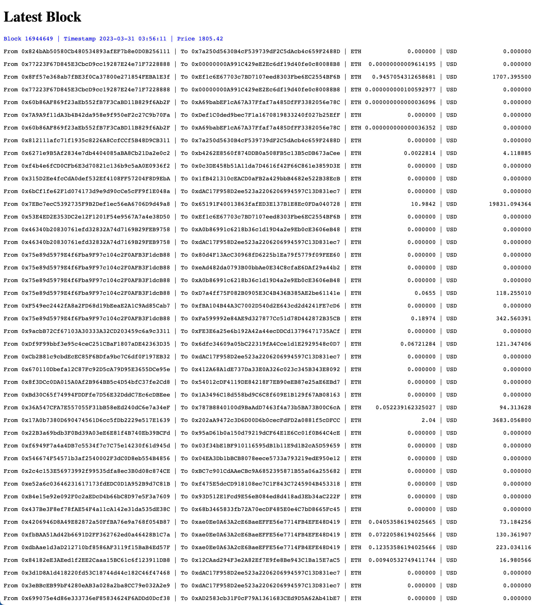

# Latest Block

This builds a simple one-page website to get the latest block info from the Ethereum blockchain.

## Design

The website uses the classical frontend/backend stack, connected through HTTP and WebSocket. The backend is built with [Flask](https://flask.palletsprojects.com/en/2.0.x/), [Flask-SocketIO](https://github.com/miguelgrinberg/Flask-SocketIO), and [web3.py](https://web3py.readthedocs.io/en/stable/) for the core function.

We actively poll the latest block info from the Ethereum blockchain every 1s, push the info to the frontend through WebSocket and display it on the web page with each refresh. It is a simple design but works well for the purpose because the Ethereum blockchain updates every 12s, and for most display purposes having a 1s delay is generally OK. If near-real-time display is needed, use websocket to low-latency source to get notified of the new block without polling, and use a faster and more scalable language.

Within each block, there are a few hundred transactions. We use a green thread pool to fetch the transaction info in parallel and then aggregate the results to display on the web page. The number of threads can be configured to scale with the number of transactions in a block to keep up with the latency requirements.

There is only one "global" fetcher that does the necessary work only once. All clients will simply see the same view of it. Therefore, the number of clients can be scaled with minimal resource consumption.

Note for a simple demo like this, we could process everything on the frontend with a Javascript framework, or WebAssembly. However, we use a backend to provide more extensibility and flexibility for future development.

## Run

We use [Docker](https://www.docker.com/) to define the container image, and [Docker Compose](https://docs.docker.com/compose/) to run the container. Please use the following command:

```bash
docker compose build
docker compose up
```

You'll see the clock ticking:

```bash
git:(main) docker compose up
[+] Running 2/1
 ⠿ Network default  Created                                                                                                                                                                                                                                                                                 0.0s
 ⠿ Container app-1  Created                                                                                                                                                                                                                                                                                 0.1s
Attaching to app-1
app-1  | 2023-03-31 03:55:11.612 | INFO     | __main__:global_ticker:30 - New block [16944643] found.
app-1  | 2023-03-31 03:55:12.214 | DEBUG    | block_utils:get_latest_block:63 - Timestamp: 2023-03-31 03:54:59 Block Number: 16944643 Price: 1804.86
```

Now open your browser and go to http://localhost:5001. You can open multiple windows/tabs, and they will all get updates.

Here is a demo screenshot:

{: style="width: 90%;max-width:600px" }

## Future Work

- Test cases for a few key functions
- Benchmark server scalability
